# Full-Stack MERN E-Commerce Platform

## Project Overview
This repository contains a comprehensive, full-stack E-Commerce web application developed using the **MERN Stack** (MongoDB, Express.js, React.js, Node.js). The platform is designed to provide a seamless shopping experience for customers and a robust, centralized management system for administrators. It features complete e-commerce functionalities, including advanced order tracking, pre-order capabilities, and an automated email notification system.

## Technology Stack
- **Frontend:** React.js (Component-driven UI, State Management)
- **Backend:** Node.js, Express.js (RESTful API architecture)
- **Database:** MongoDB (NoSQL database for flexible schema design)
- **Additional Tools:** Nodemailer (for automated email notifications)

## Core Features

### 🛍️ Customer Portal
- **Product Browsing & Pre-Order:** Users can view featured products and place pre-orders seamlessly.
- **Secure Checkout & Payment:** A streamlined checkout process supporting multiple payment methods.
- **Order Confirmation & Tracking:** Customers receive real-time order confirmation messages and can track their order status step-by-step.

### ⚙️ Admin Control Panel
- **Centralized Dashboard:** A comprehensive overview of system metrics, total orders, and revenue.
- **Order Management:** Admins have full authority to review, approve, or cancel user orders. 
- **Automated Email Notifications:** Triggered automatically when an admin approves or cancels an order, keeping the customer informed via email.
- **Inventory & Product Management:** Secure interfaces to add new products and manage existing inventory.
- **User Management:** Admin interface to monitor and manage registered users and customer details.

---

## Application Interfaces (System Walkthrough)

### Customer Experience
**Featured Products & Storefront**
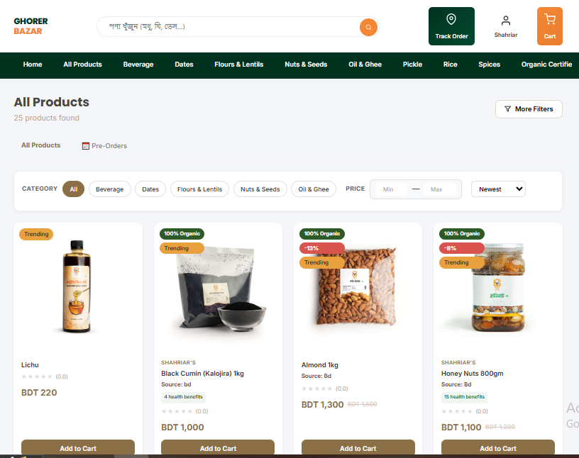

**Checkout Process & Payment Methods**
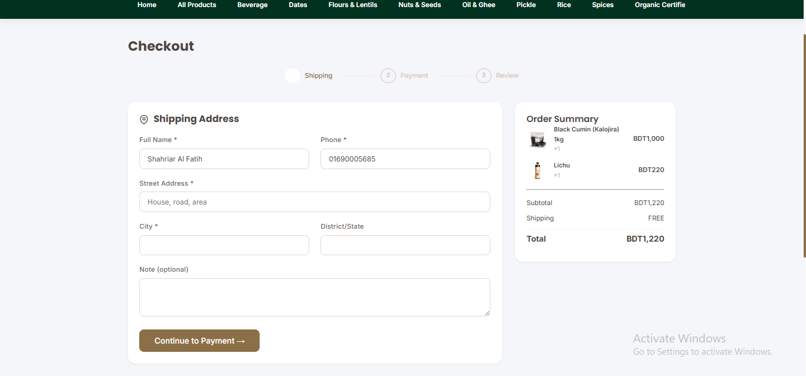
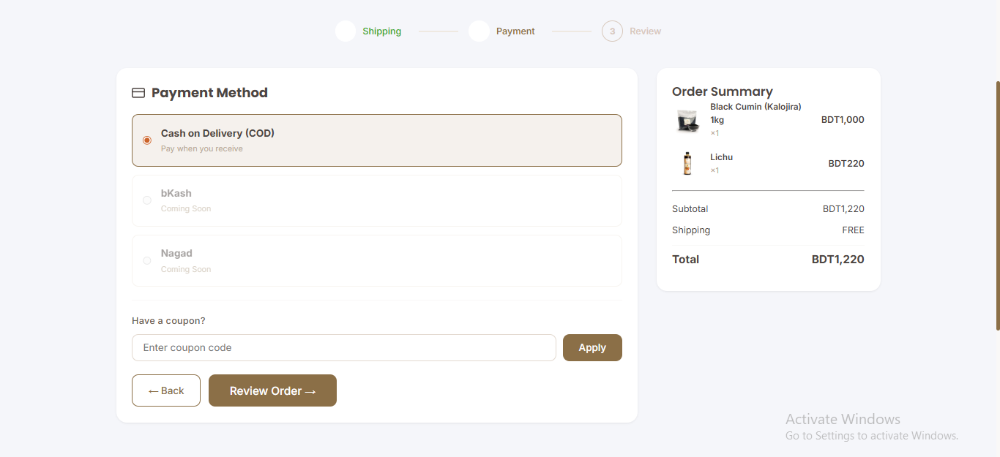

**Order Confirmation & Customer Tracking**
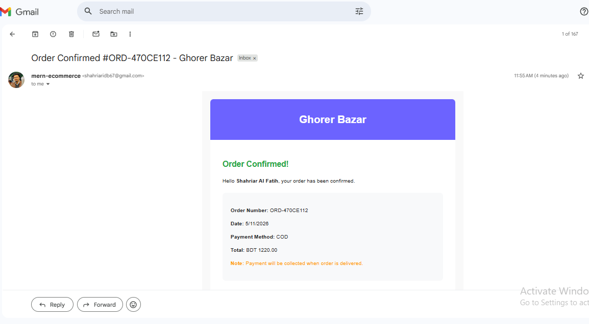
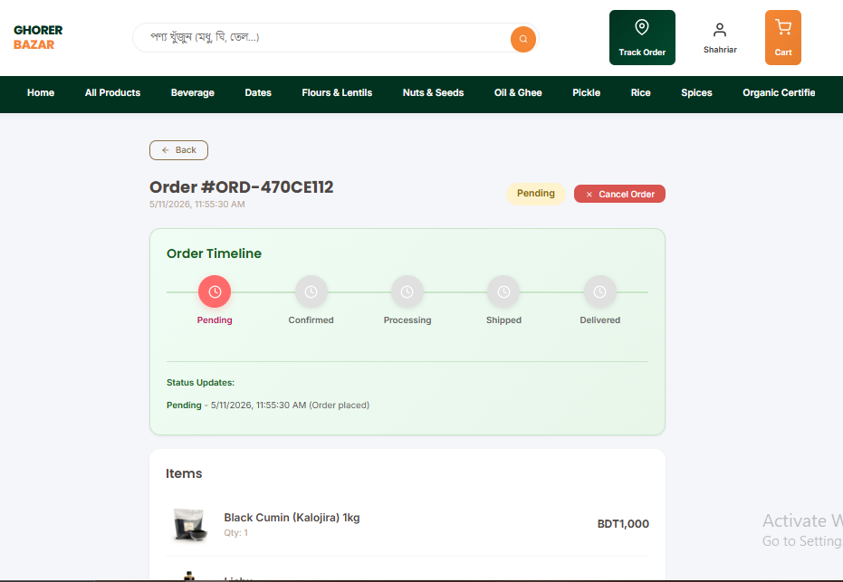

### Administrator Experience
**Admin Dashboard Overview**
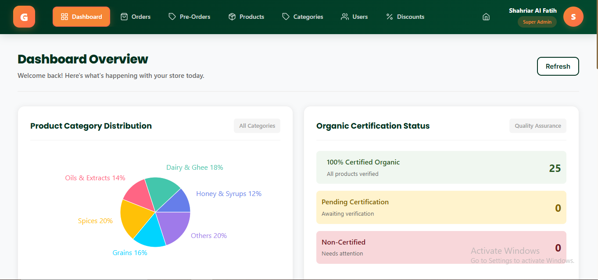

**Inventory Management (Add Product)**
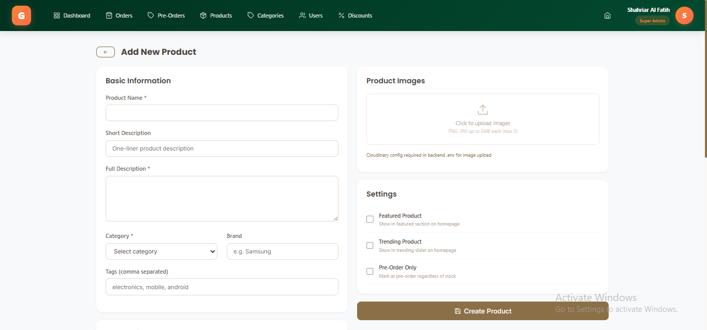

**User Management System**
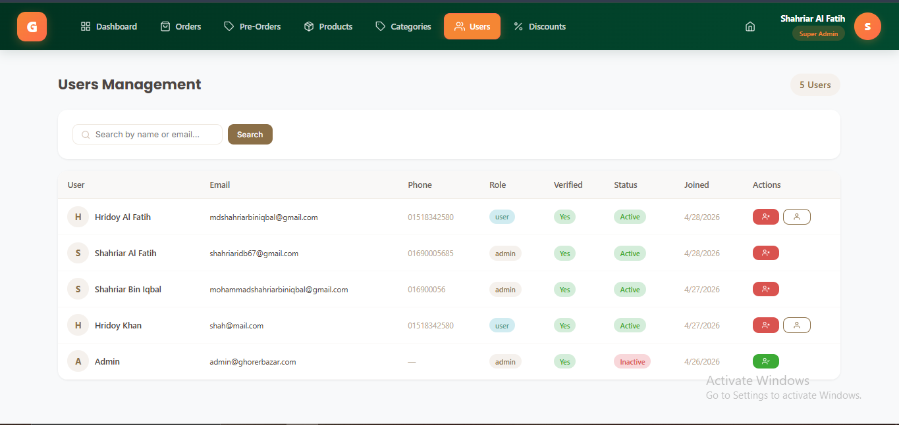

**Order Management & Approval System**
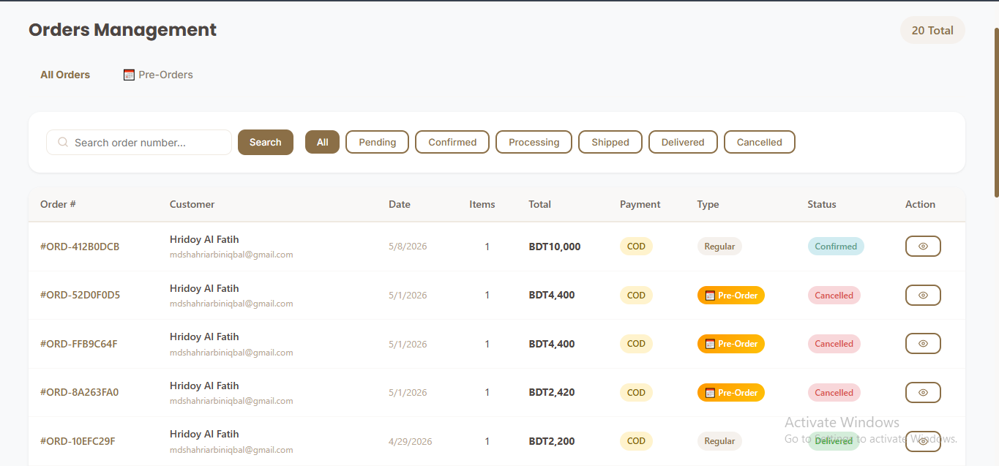

**Admin Order Tracking & Status Updates**
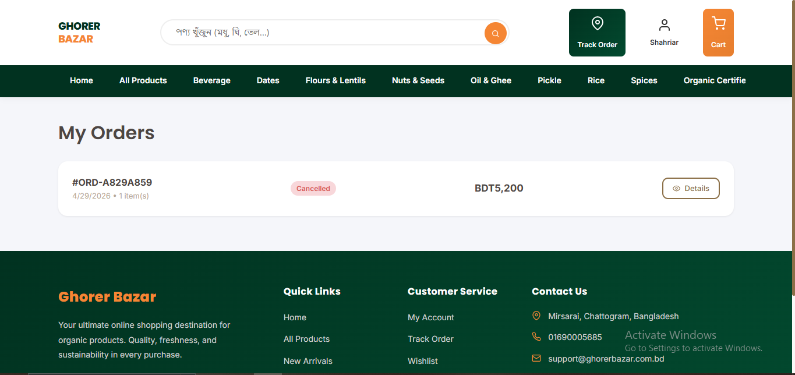
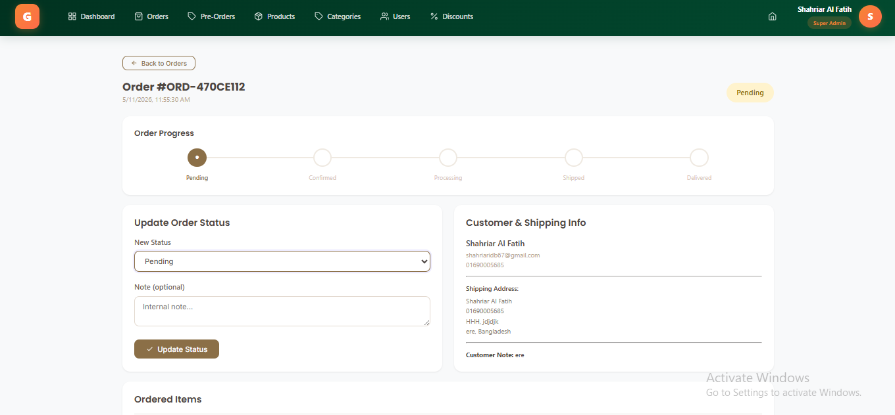

---

